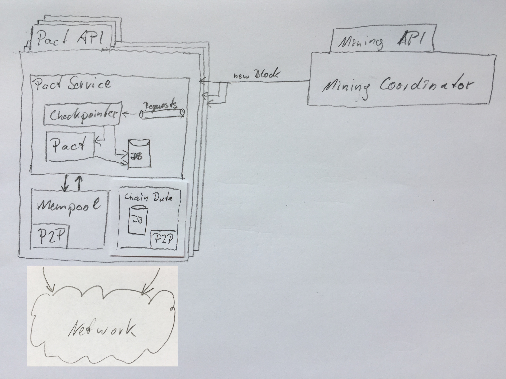

# Chainweb Client APIs

# Chainweb with Per-Chain Consensus

*   Where are the new Blocks stored?
*   Why don't we store them per chain in PactService

*   Braiding! Let mining take care of braiding?

Let miners pick the braiding and verify braiding for each block that arrives

# Chainweb Consensus

*   *Consensus is on Chainweb level (not per chain)*

    In Code: `Web*` components (e.g. `WebBlockHeaderDb`)

*   Need algorithm that makes braiding validation efficient.

# Cut

*   Inductively maintain a valid braiding

*   Distributed algorithm (Lattice, eventual consistency)

